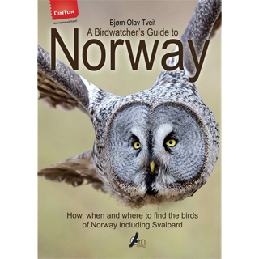

## A Birdwatcher's Guide to Norway

**-Where, When and How to find the Birds of Norway including Svalbard** the best-selling travellers guide for birders visiting Norway - buy it here now!

**Author:** Bjørn Olav Tveit  
**ISBN** 978-82-998062-4-4  
**Format:** 148 x 210 mm, 471 pages  
**Illustrations:** Hundreds of pictures and maps in full colour  
**Binding:** Softcover with flaps  
**Price:** EUR 46  
**Publisher:** Ørn forlag in cooperation with **[Din tur - Norway Nature Travel](http://www.bird.dintur.no/)**

For the first time ever, here is a guide to the birdwatching sites of Norway, including the arctic archipelago of Svalbard (Spitsbergen). More than 350 sites are covered with detailed maps and descriptions on what to see, when to go and how to get there on your own. The book includes famous places such as Finnmark, Varanger, Pasvik, Lofoten, Utsira, Lista and Jæren, and shows you many of the best birds near cities such as Oslo, Bergen, Trondheim, Stavanger and Tromsø.

## The book explains

- Where and when to go
- What weather you should hope for
- What species you may find
- The best tactics to approach each site
- Other animals you may encounter
- _Din Tur_’s photo hides, guided tours and accommodation

Here are also suggestions and advice on how to find the most sought-after species, including Lesser White-fronted Goose, King Eider, Steller’s Eider, Smew, Hazel Grouse, Rock Ptarmigan, Capercaillie, White-billed Diver, Storm Petrel, White-tailed Eagle, Gyr Falcon, Dotterel, Broad-billed Sandpiper, Ruff, Jack Snipe, Great Snipe, Grey Phalarope, Long-tailed Skua, Ross’s Gull, Ivory Gull, Sabine’s Gull, Brünnich’s Guillemot, Little Auk, Puffin, Eagle Owl, Snowy Owl, Hawk Owl, Ural Owl, Great Grey Owl, Black Woodpecker, Three-toed Woodpecker, Red-throated Pipit, Waxwing, Thrush Nightingale, Bluethroat, Barred Warbler, Arctic Warbler, Bearded Tit, Siberian Tit, Siberian Jay, Arctic Redpoll, Parrot Crossbill, Common Rosefinch, Pine Grosbeak, Rustic Bunting, Little Bunting and many more!
