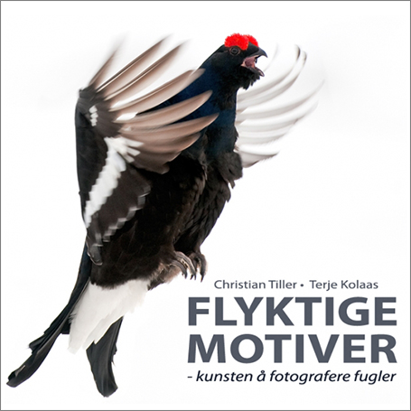

## Flyktige motiver - kunsten å fotografere fugler

Her får du alle de praktiske triksene for å løfte bildene dine fra det ordinære til det spektakulære. Boka ble raskt utsolgt fra forlaget, men er fremdeles å få tak i bl.a. fra [Natur og fritid](http://www.naturogfritid.no/default.asp?VS=detalj&ID=800003)! Fugler er blant de mest krevende av alle motiver, og samtidig av de mest givende. Du kan ikke bare stole på utstyret, du må kjenne det ut og inn. Du må forstå lyset og hvordan du fanger det. Du må lese motivet og fryse øyeblikket - det rette øyeblikket. Mestrer du fuglefotografering, mestrer du det meste. Christian Tiller og Terje Kolaas har i mange år bergtatt oss med fuglebilder som går langt ut over det å avbilde fugler. De har dessuten årelang pedagogisk erfaring. I denne boka deler de uselvisk av sin kunnskap. Her får du, trinn for trinn, alle de praktiske triksene som skal til for at du skal løfte bildene dine fra det ordinære til det spektakulære.

**Fra innholdet:**

- Grunnleggende fotokunnskap
- Full utstyrsoversikt: hva trenger du?
- Hvordan fange og kontrollere lyset
- Hvordan få knivskarpe bilder
- Bildekomposisjon
- Hvordan tilnærme deg fuglene - art for art
- Teknikker for fantastiske fluktbilder
- Bruk av blits og fjernstyring
- Fotografering gjennom teleskop
- Videofilming med digital speilrefleks
- Arkivering, bilderedigering og datautstyr
- Bildesalg
- Fotoetikk
- og mye mer

Boka er illustrert med fantastiske bilder og pedagogiske illustrasjoner.

**Flyktige motiver - kunsten å fotografere fugler**  
**Forfattere:** Christian Tiller og Terje Kolaas  
**Utgiver:** Ørn forlag  
**ISBN:** 978-82-998062-5-1  
**Format:** 245 x 225 mm  
**Omfang:** Ca. 280 s.  
**Innbinding:** Innbundet  
**Pris:** 398,-  
**Utgivelsesmåned:** September 2011

[Sjekk også bokas egen blogg!](http://flyktigemotiver.blogspot.com/)
