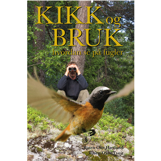

## Kikk og Bruk

Korrekt oppførsel og antrekk er viktig i selskapslivet, men du kan også trenge veiledning når du skal ut og se på fugler! Enten du er fersk som et nylagt egg, eller du allerede er en flyvedyktig fugleentusiast, vil du ved å følge tipsene og rådene i denne boken løfte fuglegleden din til nye høyder.

  
Boken forteller bl.a. hvordan du:  
• bruker kikkert og annet nødvendig utstyr  
• finner fuglene • lager et fuglerikt fuglebrett  
• bygger og henger opp fuglekasser  
• artsbestemmer fugler  
• lærer deg fuglelyder og fuglesang

Og du får tips om opplevelser året rundt, som:  
• vårens første trekkfugler  
• ugleturer i natten  
• vadere på sommerstranden  
• tiurleik fra kamuflasjehytte  
• havfuglspeiding i høststormen  
• titusener av fugler som forlater oss før vinteren

**Tittel:** Kikk og bruk - hvordan se på fugler
**Forfattere:** Bjørn Ove Høyland og Bjørn Olav Tveit  
**Pris:** 398,-  
**Format:** 160x240 mm  
**Sider**: 200 s.  
**Innbinding**: Hard perm  
**ISBN:** 978-82-93314-01-1

Bestill nå ved å sende epost til [bestilling@ornforlag.no](mailto:bestilling@ornforlag.no?subject=Bestilling av Kikk og bruk - hvordan se på fugler). Bok og faktura kommer i posten.  
Du kan også kjøpe den i alle landets bokhandlere.

## Anmeldelser

_["NOFs landsdekkende medlemsblad Vår fuglefauna nr. 4 2014:  
](http://kikkogbruk.no/Anmeldelse_Kikk_og_bruk_Vaar_Fuglefauna.jpg)_\*\*

**"Vårens store begivenhet på bokfronten" - les anmeldelse av boka her:**  
](https://atgrims.blogspot.no/2014_05_01_archive.html)

> **_"Veldig inspirerende bok, som alle fugleinteresserte MÅ ha!"_**  
> Rita Birkeland, fotograf

**Se TV-reportasje med forfatter Bjørn Olav Tveit på fugletur:**  
](http://www.tv8norge.no/Video/22406/2014/05/07/Bjørn-Olav-Tveit-lever-for-å-se-på-fugler)
