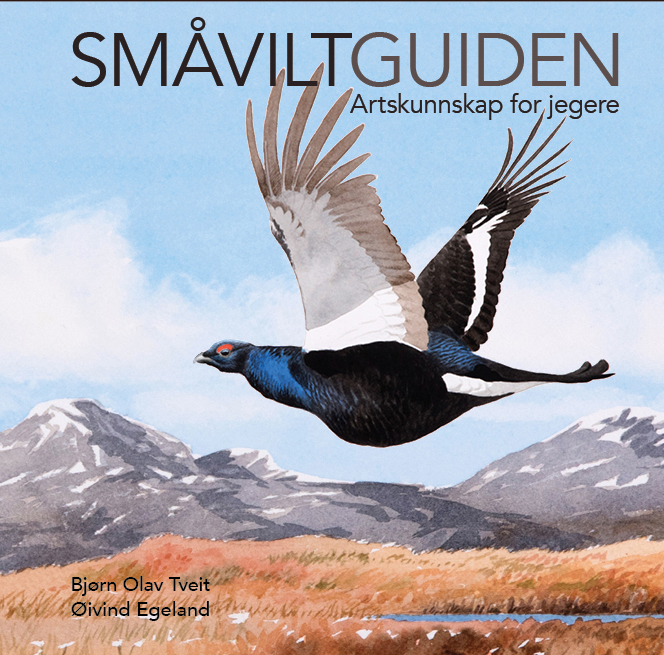
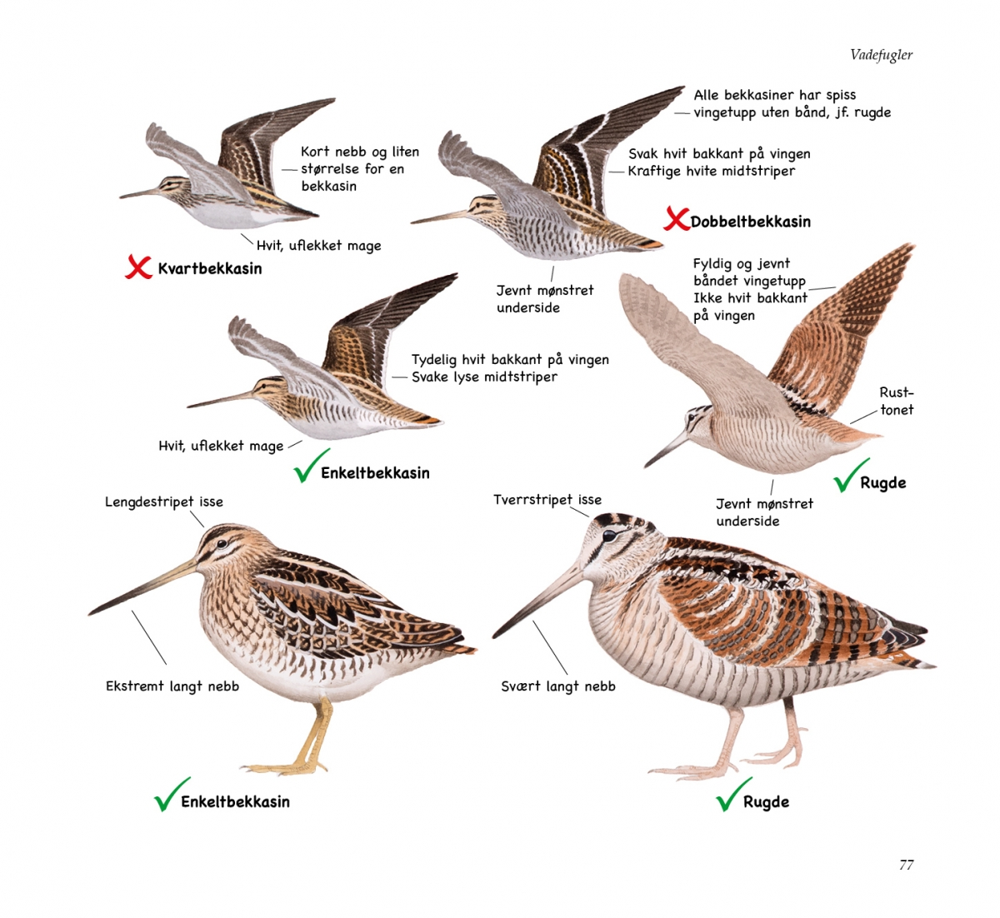
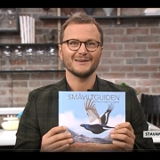
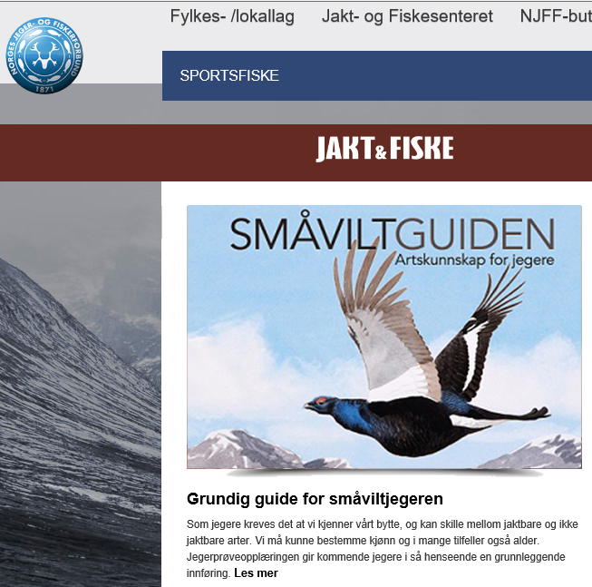
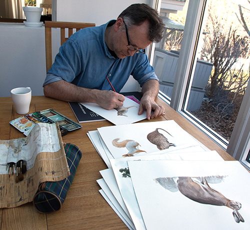

## Hvordan skille jaktbart fra fredet vilt

Det er det viktigste en jeger må kunne. Samtidig er det kanskje også det vanskeligste, noe ikke minst erfaringer fra jegerprøvene viser. Denne boka forteller på en enkel måte hvordan du i typiske jaktsituasjoner ser forskjell på de artene du kan felle - og hvilke du må la gå. Samtidig får du mye nyttig og spennende informasjon om viltet. En god jeger kjenner sitt bytte!

Boka viser artene i riktige drakter i forhold til jakttidene, i like positurer så de lett kan sammenliknes, med piler til de viktigste kjennetegnene, og med symboler som viser hvilke som kan jaktes og hvilke som er fredet:  

Småviltguiden er basert på den nye Jaktforskriften for 2017-2022, med nye jakttider og oppdatert med hvilke arter som ikke lenger er jaktbare - foruten en ny jaktbar art!

De livaktige illustrasjonene er malt av Øivind Egeland, en av Skandinavias mest begavede naturkunstnere. Bjørn Olav Tveit er blant våre ledende eksperter på artskunnskap og feltkjennetegn.

Sammen har de laget en pedagogisk og lettfattelig guide til hvordan skille alle jaktbare arter fra sine fredete forvekslingsarter, nyttig enten du skal ut på jakt eller er på vei til å ta jegerprøven.

**Tittel: Småviltguiden - artskunnskap for jegere**  
**Tekst:** Bjørn Olav Tveit  
**Illustrasjoner:** Øivind Egeland  
**Format:** 245 x 225 mm  
**Omfang:** 136 sider  
**ISBN:** 978-82-998062-7-5  
**Pris:** kr 398,-  
**Utgitt:** Høsten 2017

**[Se det artige innslaget om Småviltguiden på TV2s _God morgen, Norge_!](http://www.tv2.no/v/1236888/)**<

**Hylles av Jegerforbundet!**  
Norges Jeger- og Fiskerforbunds medlemsblad **Jakt & Fiske** omtaler Småviltguiden som en «særdeles grundig guide for småviltjegeren», med «detaljerte og naturtro tegninger og akvareller», der «også erfarne småviltjegere vil kunne lære noe nytt»!  
[Les hele anmeldelsen på nett her!
](https://www.njff.no/tema/jaktogfiske/Sider/Grundig-guide-for-smaviltjegeren.aspx)

**Se Øivind Egeland trylle fram forsideillustrasjonen!**'

<iframe allowfullscreen="" frameborder="0" height="315" src="https://www.youtube.com/embed/JF_mCf7Zyig?rel=0" width="560"></iframe>

  
Øivind Egeland fra Sandnes regnes som en av Skandinavias fremste naturkunstnere.

<form action="https://www.paypal.com/cgi-bin/webscr" method="post" target="_top"><input name="cmd" type="hidden" value="_s-xclick"> <input name="hosted_button_id" type="hidden" value="VVZ3ZFMKLQAAU"> <input alt="PayPal – en trygg og enkel betalingsmetode på nettet!" border="0" name="submit" src="https://www.paypalobjects.com/no_NO/NO/i/btn/btn_buynowCC_LG.gif" type="image"> </form>
